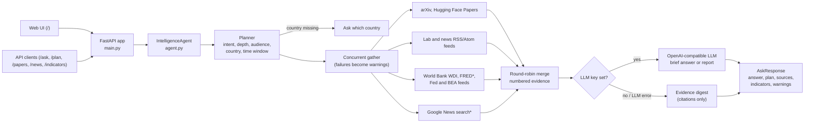

# devin-projects

A small FastAPI todo service used as a sandbox for practicing Devin workflows: delegating tickets, fixing CI, and iterating on playbooks against a real codebase.

## Setup

```bash
python -m venv .venv && source .venv/bin/activate
pip install -e ".[dev]"
```

## Commands

| Task | Command |
| --- | --- |
| Run the API | `uvicorn todo_api.main:app --reload --app-dir src` |
| Run tests | `pytest -q` |
| Lint | `ruff check .` |
| Format | `ruff format .` |

Interactive API docs are at `http://localhost:8000/docs` once the server is running.

## API

| Method | Path | Description |
| --- | --- | --- |
| GET | `/health` | Liveness check |
| GET | `/todos` | List todos |
| POST | `/todos` | Create a todo (`{"title": "...", "done": false}`) |
| GET | `/todos/{id}` | Fetch one todo |
| PATCH | `/todos/{id}` | Update title and/or done |
| DELETE | `/todos/{id}` | Delete a todo |

Storage is in-memory, so data resets when the process restarts.

## AI Research, Innovation & Market Intelligence Agent

A FastAPI service (`src/intel_agent`) that answers questions about AI research, AI industry news, country AI opportunities, AI jobs and the economy. It grounds its answers in live data it fetches from trusted sources, then uses an LLM to write the answer.



\* optional: FRED needs `FRED_API_KEY`; news search needs `ENABLE_NEWS_SEARCH=1`.

How it works:

1. **Plan**: rule-based classification of the question: intent (innovations, research papers, country opportunities, country vs. U.S., jobs, economy, general), depth (brief answer or deep-research report, e.g. "give me a report", "deep dive"), audience (researcher, entrepreneur, student, ...), country (fills a `{{country}}` placeholder) and time window ("today", "this week", "last 3 days", ...). If a question needs a country and none is given, the agent asks which country instead of guessing.
2. **Gather**: concurrent fetches from the sources that fit the intent:

   | Source | Used for |
   | --- | --- |
   | arXiv API, Hugging Face daily papers | Research papers |
   | OpenAI News, Google DeepMind, Microsoft Research | Lab announcements |
   | MIT Technology Review, TechCrunch, The Verge, MIT News, Nature Machine Intelligence | Innovation and industry news |
   | Federal Reserve and BEA press feeds, FRED (optional key) | U.S. economy |
   | World Bank WDI API | Country economy, technology and labor indicators |
   | Google News RSS search (opt-in) | Country-specific news |

   A source that fails is reported in `warnings`; the answer is still built from the sources that responded.
3. **Synthesize**: an OpenAI-compatible chat model receives the agent rules (cite evidence as `[n]`, separate facts from inference, never invent statistics, answer "so what?"), the section structure for the intent and depth, and the numbered evidence. Without `LLM_API_KEY` the service returns a digest of the evidence with citations and no synthesis.

Anthropic, Reuters, BLS and IMF have no feed or API this service can reach reliably without authentication, so they are not fetched directly. The LLM is told to prefer those sources when it cites them from the evidence.

### Run

```bash
python -m venv .venv && source .venv/bin/activate
pip install -e ".[dev]"
cp .env.example .env             # optional: put your keys here; without an LLM key you get an evidence digest
uvicorn intel_agent.main:app --reload
```

Settings come from environment variables or a `.env` file in the directory you start the server from (`.env` is git-ignored). A variable exported in the shell overrides the same one in `.env`. Restart the server after changing either.

Open `http://localhost:8000/` for the web UI or `http://localhost:8000/docs` for the API docs.

| Env var | Default | Purpose |
| --- | --- | --- |
| `LLM_API_KEY` / `OPENAI_API_KEY` | unset | Turns on LLM synthesis |
| `LLM_BASE_URL` | `https://api.openai.com/v1` | Any OpenAI-compatible endpoint |
| `LLM_MODEL` | `gpt-4o-mini` | Chat model name |
| `FRED_API_KEY` | unset | Adds the latest U.S. fed funds rate, unemployment, CPI and real GDP growth |
| `ENABLE_NEWS_SEARCH` | off | Adds Google News RSS keyword search for country questions (the feed's terms limit it to personal, non-commercial use) |
| `HTTP_TIMEOUT` | `20` | Timeout for each source request, in seconds |

### Endpoints

| Method | Path | Description |
| --- | --- | --- |
| POST | `/ask` | `{"question": "...", "country": "Malaysia", "audience": "entrepreneur", "mode": "report"}`; `country`, `audience` and `mode` are optional |
| POST | `/plan` | Returns only the planner's classification of the question |
| GET | `/papers?topic=agents&days=7&source=arxiv\|huggingface` | Recent papers |
| GET | `/news?group=tech_news\|labs\|research_news\|economy&q=...` | Recent items from the monitored feeds |
| GET | `/indicators/{country}?compare_us=true` | World Bank indicators, plus FRED data for the U.S. when `FRED_API_KEY` is set |
| GET | `/health` | Liveness check and which optional keys are configured |

Run the checks with `ruff check .`, `ruff format --check .` and `pytest -q`. Tests replace every outbound HTTP call with `httpx.MockTransport`, so they run offline.

## CI

GitHub Actions runs `ruff check`, `ruff format --check`, and `pytest` on every pull request.
